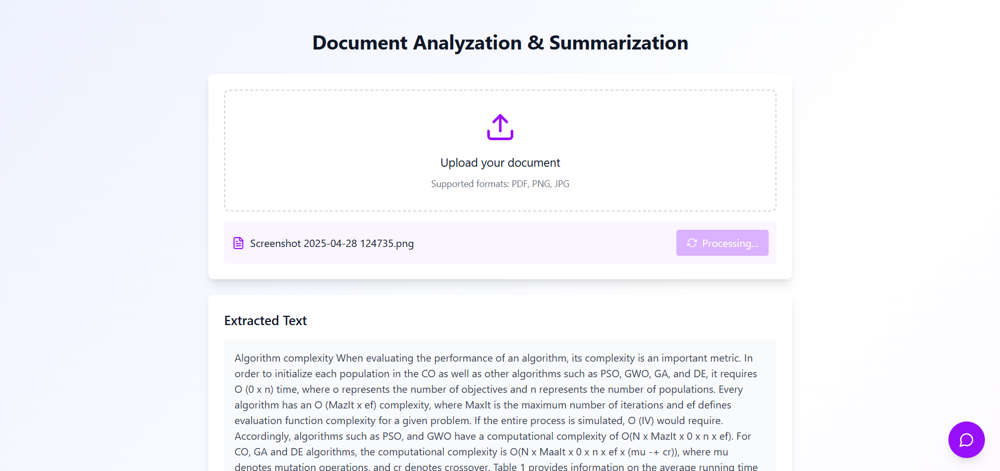
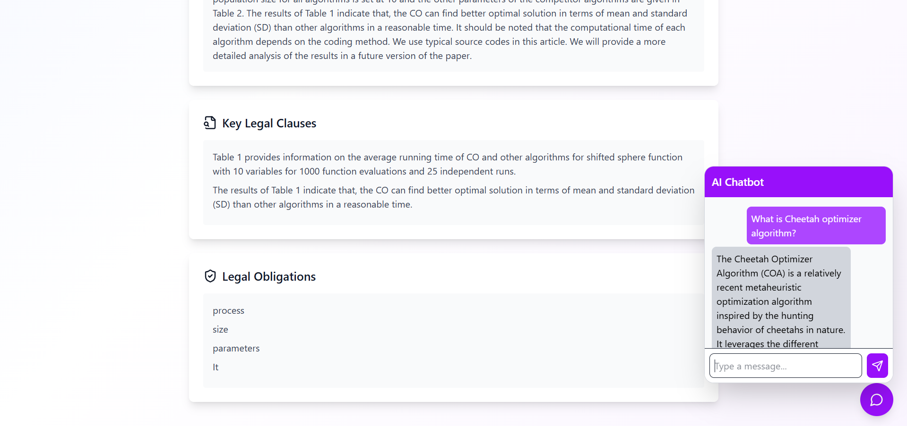

# 🧠 DocBrief – AI-Powered Document Summarization & Analysis

DocBrief is an AI-powered web application that simplifies lengthy documents into concise, machine-readable summaries. It also provides intelligent chatbot assistance for document-related queries. Designed with a futuristic UI, DocBrief aims to make legal, academic, and technical content easier to understand and navigate.


## 🚀 Features

- ⚡ **AI-Powered Summarization** – Generate precise summaries using a fine-tuned BART model.
- 💬 **Smart Chatbot Assistant** – Ask questions based on your uploaded document.
- 📄 **Supports PDFs & Text Files** – Upload documents to extract and summarize content.
- 🔎 **Readable Output** – Makes scanned or image-based text machine-readable using OCR.
- 🌐 **Modern UI** – Built with React, Vite, and Tailwind CSS.


## 🛠️ Tech Stack

**Frontend**  
- React.js  
- Vite  
- Tailwind CSS  

**Backend**  
- Python (Flask + Flask-CORS)  
- Hugging Face Transformers (BART)  
- spaCy, NLTK, Scikit-learn (for NLP)  
- pdfplumber, Pytesseract, Pillow (for OCR)

## 🖥️ Live Preview

Check out the live deployed version:  
🔗 [xyz](xyz)

## 📸 Screenshots





## 📦 Getting Started

### Installation
```bash
git clone https://github.com/SujalAgrawal08/DocBrief.git
cd DocBrief
pip install -r requirement.txt
python app.py
cd Frontend
npm install
npm run dev
```

## ✨ Future Enhancements
- 🔒 OAuth & Google Sign-In
- ☁️ Cloud storage for uploaded files
- 📊 Summary analytics dashboard
- 📚 Multi-document summarization

Made with ❤️ by Sujal Agrawal
