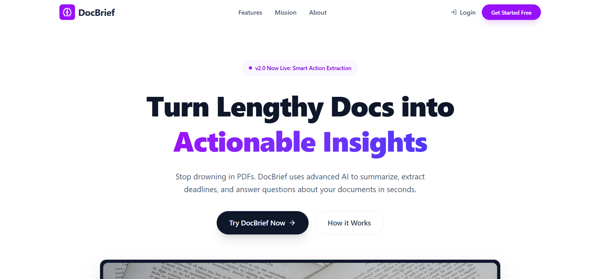
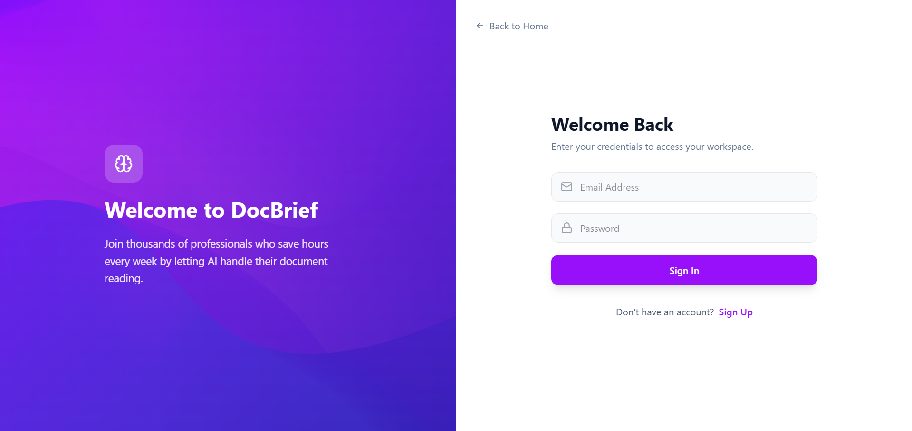
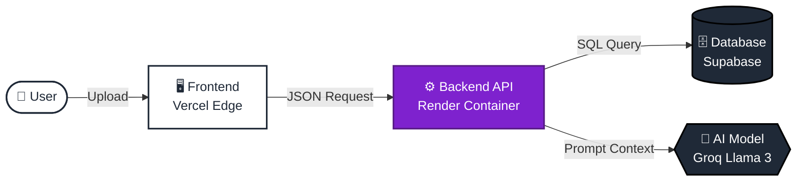
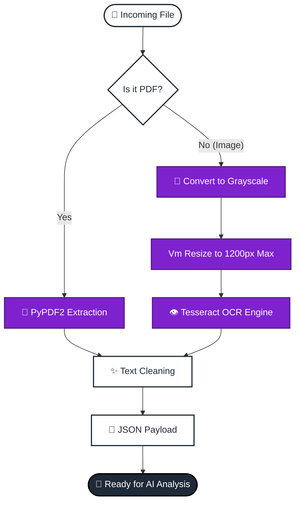
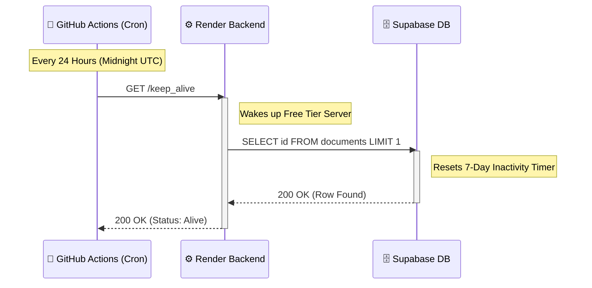

<div align="center">

# 📘 DocBrief

### Transform Documents into Actionable Intelligence

[](https://vitejs.dev/)
[](https://python.org)
[](https://docker.com)
[](https://www.postgresql.org/)

A production-grade AI SaaS application that transforms lengthy PDFs, text files, and scanned images into structured insights using **Generative AI (RAG)** and **Optical Character Recognition (OCR)**.

[](https://docbrief.vercel.app)
[](../../issues)
[](../../issues)

---



<br/><br/>



</div>

## 🏗️ System Architecture

DocBrief follows a **Decoupled Client-Server Architecture** to ensure scalability and separation of concerns.

- **Frontend (Client)**: Single Page Application (SPA) hosted on Vercel  
- **Backend (Server)**: Containerized Python application hosted on Render  
- **Database**: Supabase (PostgreSQL) with Row Level Security (RLS)

### High-Level System Architecture 



## 🛠️ Tech Stack

| Component  | Technology                    | Role                                                      |
|------------|-------------------------------|-----------------------------------------------------------|
| Frontend   | React.js + Vite               | Core UI library & fast build tool                         |
|            | Tailwind CSS                  | Utility-first styling for responsive design               |
|            | Recharts                      | Data visualization (charts & graphs)                      |
|            | jsPDF                         | Client-side PDF report generation                         |
| Backend    | Python 3.9 + Flask            | API framework                                             |
|            | Docker                        | Containerization (OS-level dependencies)                  |
|            | PyPDF2                        | Native text extraction for PDFs                           |
|            | Tesseract OCR + pytesseract   | Text extraction for images/scanned docs                   |
|            | Groq API                      | Fast inference LLM (Llama 3 8B/70B models)                 |
|            | Flask-Limiter                 | API rate limiting & DDoS protection                       |
| Database   | Supabase (PostgreSQL)         | Storage + Row Level Security (RLS)                        |
| DevOps     | GitHub Actions                | CI/CD automation + Keep-alive scripts                     |

## ⚙️ Key Features & Implementation Logic

### A. Smart Document Processing (OCR & Text Extraction)
**Goal**: Convert any file format (PDF, PNG, JPG) into raw text for the AI.

**How it works**:
- File Type Detection → extension check
- Native PDFs → PyPDF2 (fast & accurate)
- Images/Scanned PDFs → Optimized OCR Pipeline:
  - Preprocessing: Grayscale + resize to max 1200px
  - Extraction: Tesseract v5 via pytesseract
- Code: `app.py → /extract_text` endpoint

### B. RAG-Powered Analysis (Summarization & Insights)
**Goal**: Generate structured intelligence from raw text.

**How it works**:
1. Extracted text sent to backend
2. Strict system prompt enforces JSON output:
   ```json
   {
     "summary": "...",
     "clauses": [...],
     "action_items": [...]
   }
3. Groq API (Llama 3 8B) inference
4. Backend parses & cleans JSON response
* Code: app.py → /analyze_document endpoint

### C. Interactive Context-Aware Chatbot
How it works:
* Frontend sends document text + user question
* Backend injects full document context into prompt
* LLM answers strictly based on provided document only

### D. Analytics Dashboard
* **Complexity Score**: Based on sentence length, vocabulary density, clause count
* Visualization via Recharts (Bar Charts, KPI cards)
* Fully responsive with `<ResponsiveContainer>` fixes

### E. Secure Public Sharing
* Supabase RLS policies allow public SELECT on specific rows
* Dynamic route `/share/:id` renders read-only dashboard
* Owner retains full control (UPDATE/DELETE restricted)

## 🛡️ Security & Scalability Measures
1. **Docker Containerization**
   Custom Dockerfile installs `tesseract-ocr` + `libtesseract-dev` → consistent deployment on Render
2. **API Rate Limiting**
   Flask-Limiter → 10 requests/minute (protects free-tier backend)
3. **CORS Hardening**
   Whitelists only `https://docbrief.vercel.app`
4. **Database & Service Keep-Alive**
   GitHub Action runs daily cron → `hits /keep_alive` endpoint → prevents Supabase pause & keeps Render warm

## 🚀 Deployment Pipeline
Fully automated Continuous Deployment:
1. Push to `master` → GitHub
2. Vercel auto-deploys frontend (Edge Network)
3. Render auto-builds new Docker image & restarts service
4. Live in ~2 minutes

## 📍 Workflow

### Intelligent Extraction Pipeline (OCR Logic)


### Automated Maintenance & Keep-Alive Flow



## 📂 Directory Structure
```bash
DocBrief/
├── frontend/ (Root for Vercel)
│   ├── src/
│   │   ├── components/ (AnalyticsWidget, Chatbot, etc.)
│   │   ├── pages/ (Home, Work, Share)
│   │   ├── apiConfig.js (Dynamic URL logic)
│   │   └── supabaseClient.js
│   └── package.json
│
│── app.py (Main Flask Application)
│── Dockerfile (Container Config)
│── requirements.txt (Python Dependencies)
│── .env (Secrets - Not committed)
└── .github/workflows/
    └── keep-alive.yml (Automation)
```

<div align="center">
Built with ❤️ by Sujal Agrawal

</div> 
