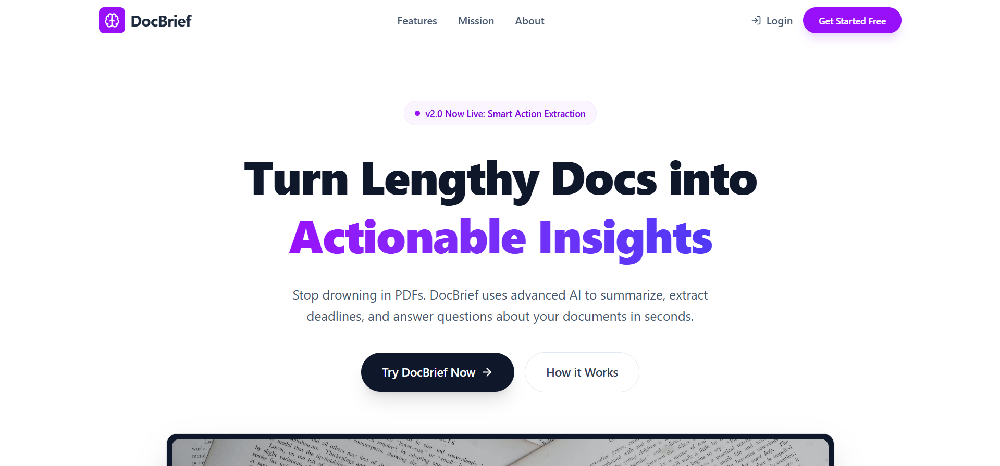
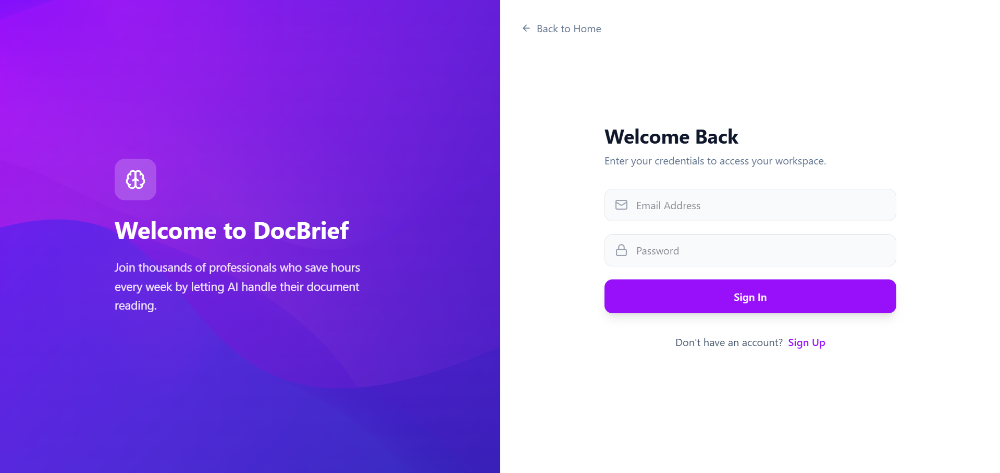
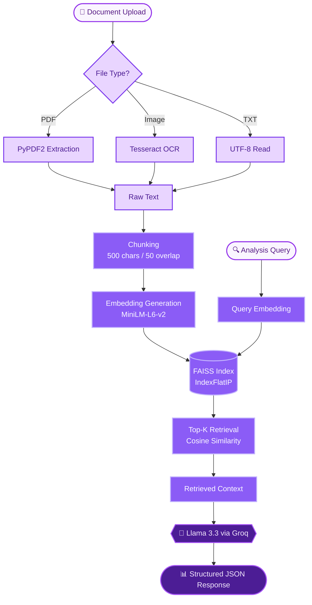
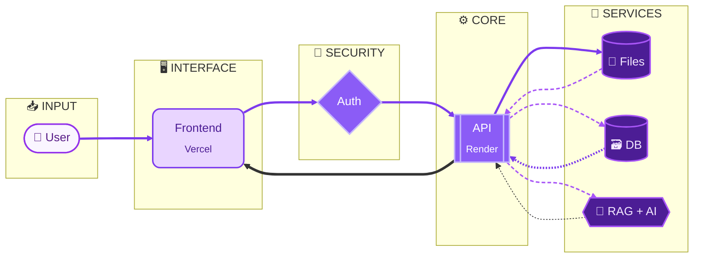
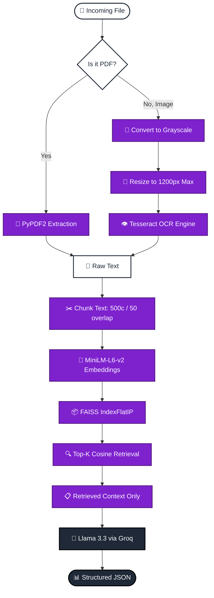
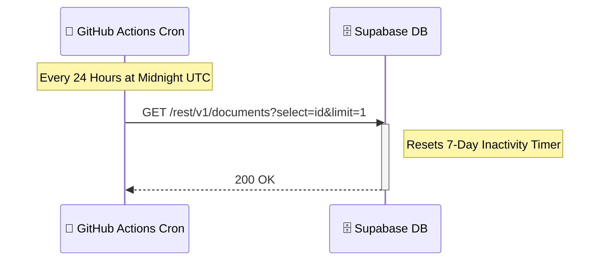

<div align="center">

# 📘 DocBrief

### Transform Documents into Actionable Intelligence

[](https://vitejs.dev/)
[](https://python.org)
[](https://docker.com)
[](https://www.postgresql.org/)

A production-grade AI SaaS application that transforms lengthy PDFs, text files, and scanned images into structured insights using a **Retrieval-Augmented Generation (RAG) pipeline** powered by **Llama 3.3** and **Tesseract OCR**.

[](https://docbrief.vercel.app)
[](../../issues)
[](../../issues)

---



<br/><br/>



</div>

## 🏗️ System Architecture

DocBrief follows a **Decoupled Client-Server Architecture** with a **genuine RAG pipeline** on the backend.

- **Frontend (Client)**: Single Page Application (SPA) hosted on Vercel  
- **Backend (Server)**: Containerized Python application hosted on Render  
- **Database**: Supabase (PostgreSQL) with Row Level Security (RLS)

### RAG Pipeline Architecture


```mermaid
flowchart TD
    classDef input fill:#faf5ff,stroke:#9333ea,stroke-width:2px,color:#581c87;
    classDef process fill:#e9d5ff,stroke:#7c3aed,stroke-width:2px,color:#4c1d95;
    classDef ai fill:#8b5cf6,stroke:#c4b5fd,stroke-width:2px,color:#ffffff;
    classDef output fill:#4c1d95,stroke:#a855f7,stroke-width:2px,color:#f3e8ff;

    A([📄 Document Upload]) --> B{File Type?}
    B -- PDF --> C[PyPDF2 Extraction]
    B -- Image --> D[Tesseract OCR]
    B -- TXT --> E[UTF-8 Read]
    C & D & E --> F[Raw Text]

    F --> G[Chunking<br/>500 chars / 50 overlap]
    G --> H[Embedding Generation<br/>MiniLM-L6-v2]
    H --> I[(FAISS Index<br/>IndexFlatIP)]

    J([🔍 Analysis Query]) --> K[Query Embedding]
    K --> I
    I --> L[Top-K Retrieval<br/>Cosine Similarity]
    L --> M[Retrieved Context]
    M --> N{{🧠 Llama 3.3 via Groq}}
    N --> O([📊 Structured JSON Response])

    class A,J input
    class B,C,D,E,F process
    class G,H,I,K,L,M ai
    class N,O output
```

### High-Level System Architecture 


```mermaid
graph LR
    classDef layer1 fill:#faf5ff,stroke:#9333ea,stroke-width:2px,color:#581c87,rx:15,ry:15;
    classDef layer2 fill:#e9d5ff,stroke:#7c3aed,stroke-width:2px,color:#4c1d95,rx:10,ry:10;
    classDef layer3 fill:#8b5cf6,stroke:#c4b5fd,stroke-width:2px,color:#ffffff,rx:8,ry:8;
    classDef layer4 fill:#4c1d95,stroke:#a855f7,stroke-width:2px,color:#f3e8ff,rx:5,ry:5;

    subgraph Input ["&nbsp;📥 INPUT&nbsp;"]
        A([" 👤 User "])
    end

    subgraph Interface ["&nbsp;🖥️ INTERFACE&nbsp;"]
        B[" Frontend<br/><sub>Vercel</sub> "]
    end

    subgraph Security ["&nbsp;🔐 SECURITY&nbsp;"]
        C{" Auth "}
    end

    subgraph Core ["&nbsp;⚙️ CORE&nbsp;"]
        D[[" API<br/><sub>Render</sub> "]]
    end

    subgraph Services ["&nbsp;🧩 SERVICES&nbsp;"]
        E[(" 📂 Files ")]
        F[(" 🗃️ DB ")]
        G{{"🧠 RAG + AI "}}
    end

    A ==> B ==> C ==> D
    D --> E & F & G
    E & F & G -.-> D
    D ==> B

    class A layer1
    class B layer2
    class C,D layer3
    class E,F,G layer4

    linkStyle 0,1,2,3,7 stroke:#7c3aed,stroke-width:3px
    linkStyle 4,5,6 stroke:#a855f7,stroke-width:2px,stroke-dasharray:5 3
```

## 🛠️ Tech Stack

| Component  | Technology                    | Role                                                      |
|------------|-------------------------------|------------------------------------------------------------|
| Frontend   | React.js + Vite               | Core UI library & fast build tool                          |
|            | Tailwind CSS                  | Utility-first styling for responsive design                |
|            | Recharts                      | Data visualization (charts & graphs)                       |
|            | jsPDF                         | Client-side PDF report generation                          |
| Backend    | Python 3.9 + Flask            | API framework                                              |
|            | Docker + Gunicorn             | Containerization & production WSGI server                  |
|            | PyPDF2                        | Native text extraction for PDFs                            |
|            | Tesseract OCR + pytesseract   | Text extraction for images/scanned docs                    |
|            | sentence-transformers (MiniLM)| Embedding generation for RAG pipeline                      |
|            | FAISS (faiss-cpu)             | Vector similarity search for chunk retrieval               |
|            | Groq API (Llama 3.3 70B)     | Fast inference LLM for analysis & generation               |
|            | Flask-Limiter                 | API rate limiting & DDoS protection                        |
| Database   | Supabase (PostgreSQL)         | Storage + Row Level Security (RLS)                         |
| Automation | GitHub Actions                | Supabase keep-alive cron (prevents DB pause)               |

## ⚙️ Key Features & Implementation Logic

### A. Smart Document Processing (OCR & Text Extraction)
**Goal**: Convert any file format (PDF, PNG, JPG) into raw text for the AI.

**How it works**:
- File Type Detection → extension check
- Native PDFs → PyPDF2 (fast & accurate)
- Images/Scanned PDFs → Optimized OCR Pipeline:
  - Preprocessing: Grayscale + resize to max 1200px
  - Extraction: Tesseract v5 via pytesseract
- Code: `app.py → /extract_text` endpoint

### B. RAG-Powered Analysis (Genuine Retrieval-Augmented Generation)
**Goal**: Generate structured intelligence from raw text using real retrieval.

**How it works**:
1. Extracted text is **chunked** into 500-character segments with 50-character overlap
2. Each chunk is **embedded** using `sentence-transformers/all-MiniLM-L6-v2` (384-dim vectors)
3. Embeddings are stored in a **FAISS IndexFlatIP** (inner product on L2-normalized vectors = cosine similarity)
4. An analysis-focused query is embedded and used to **retrieve Top-10** most relevant chunks
5. Only the retrieved context (not the full document) is sent to **Llama 3.3 70B** via Groq API
6. LLM generates structured JSON output (summary, clauses, obligations, actions)

**Why RAG matters**: Instead of truncating documents at 15K characters and hoping the important parts are at the beginning, RAG retrieves the *most relevant* sections regardless of their position in the document.

- Core module: `rag_engine.py`
- Endpoint: `app.py → /analyze_document`

### C. RAG-Powered Context-Aware Chatbot
**How it works**:
1. User asks a question about the uploaded document
2. Backend embeds the question using MiniLM-L6-v2
3. **Top-5 relevant chunks** are retrieved from the FAISS index
4. Only those chunks are injected as context into the LLM prompt
5. Llama 3.3 answers based strictly on retrieved context

- Endpoint: `app.py → /chatbot`

### D. Analytics Dashboard
* **Complexity Score**: Based on sentence length, vocabulary density, clause count
* Visualization via Recharts (Bar Charts, KPI cards)
* Fully responsive with `<ResponsiveContainer>` fixes

### E. Secure Public Sharing
* Supabase RLS policies allow public SELECT on specific rows
* Dynamic route `/share/:id` renders read-only dashboard
* Owner retains full control (UPDATE/DELETE restricted)

## 📊 Metrics & Observability

Every request through the RAG pipeline is instrumented with `time.perf_counter()`:

| Metric | What It Measures |
|--------|------------------|
| `extraction_ms` | Time for OCR/PDF text extraction |
| `chunk_ms` | Time to split text into chunks |
| `embedding_ms` | Time to generate MiniLM embeddings |
| `index_ms` | Time to build FAISS index |
| `query_embedding_ms` | Time to embed the query |
| `retrieval_ms` | Time for FAISS Top-K search |
| `llm_ms` | Time for Groq/Llama-3.3 inference |
| `total_ms` | End-to-end pipeline latency |

Access via `GET /metrics` endpoint (returns last 50 requests).

## 🛡️ Security & Reliability
1. **Docker Containerization**
   Custom Dockerfile installs `tesseract-ocr` + `libtesseract-dev` as OS-level dependencies. Docker ensures consistent deployment across environments (local, Render, AWS) without manual system package management.
2. **Gunicorn WSGI Server**
   1 worker (memory-constrained free tier), 8 threads for concurrency, 120s timeout to accommodate the full OCR → RAG → LLM pipeline.
3. **API Rate Limiting**
   Flask-Limiter → 10 requests/minute for analysis, 20/minute for chatbot (protects free-tier backend).
4. **CORS Hardening**
   Whitelists only `https://docbrief.vercel.app` and `localhost:5173`.
5. **Circuit Breaker Pattern**
   If Groq API or RAG fails, the system returns mock data to prevent UI crashes. If RAG fails, it falls back to truncated text.
6. **Health Endpoint**
   `GET /health` returns service status for monitoring.

## 🚀 Deployment

- **Frontend**: Push to `master` → Vercel auto-deploys to Edge Network
- **Backend**: Push to `master` → Render auto-builds Docker image & restarts service

### What's NOT Implemented (Honesty Section)

| Feature | Status | What Real Implementation Would Look Like |
|---------|--------|------------------------------------------|
| **CI/CD Pipeline** | ❌ Not implemented | GitHub Actions workflow with lint → test → build → deploy stages |
| **Uptime Monitoring** | ❌ Not measured | UptimeRobot, Pingdom, or custom healthcheck polling with alerts |
| **Automated Testing** | ❌ No test suite | pytest for backend, Vitest/Jest for frontend, integration tests |
| **Supabase Keep-Alive** | ✅ Implemented | GitHub Actions daily cron pings Supabase to prevent 7-day pause |

## 📍 Workflows

### RAG Pipeline Flow (End-to-End)

```mermaid
flowchart TD
    classDef purple fill:#7e22ce,stroke:#581c87,stroke-width:2px,color:white;
    classDef white fill:#ffffff,stroke:#1f2937,stroke-width:2px,color:#1f2937;
    classDef black fill:#1f2937,stroke:#000000,stroke-width:2px,color:white;

    Start([📄 Incoming File]) --> Check{Is it PDF?}
    
    Check -- Yes --> PyPDF[📖 PyPDF2 Extraction]
    Check -- No, Image --> Opt1[🎨 Convert to Grayscale]
    Opt1 --> Opt2[📏 Resize to 1200px Max]
    Opt2 --> OCR[👁️ Tesseract OCR Engine]
    
    PyPDF & OCR --> Raw[📝 Raw Text]
    Raw --> Chunk[✂️ Chunk Text: 500c / 50 overlap]
    Chunk --> Embed[🔢 MiniLM-L6-v2 Embeddings]
    Embed --> Index[📦 FAISS IndexFlatIP]
    Index --> Retrieve[🔍 Top-K Cosine Retrieval]
    Retrieve --> Context[📋 Retrieved Context Only]
    Context --> LLM[🧠 Llama 3.3 via Groq]
    LLM --> Output([📊 Structured JSON])

    class Start,Check,Raw white;
    class Opt1,Opt2,OCR,PyPDF,Chunk,Embed,Index,Retrieve,Context purple;
    class LLM,Output black;
```

### Automated Keep-Alive Flow


```mermaid
sequenceDiagram
    participant GH as 🐙 GitHub Actions Cron
    participant DB as 🗄️ Supabase DB

    Note over GH: Every 24 Hours at Midnight UTC
    
    GH->>DB: GET /rest/v1/documents?select=id&limit=1
    activate DB
    Note right of DB: Resets 7-Day Inactivity Timer
    
    DB-->>GH: 200 OK
    deactivate DB
```

## 📂 Directory Structure
```bash
DocBrief/
├── Frontend/               # React SPA (Vercel)
│   ├── src/
│   │   ├── components/     # AnalyticsWidget, Chatbot, Work, etc.
│   │   ├── apiConfig.js    # Dynamic API URL
│   │   └── supabaseClient.js
│   └── package.json
│
├── app.py                  # Flask API (RAG-integrated endpoints)
├── rag_engine.py           # RAG module (chunking, embedding, FAISS, retrieval)
├── Dockerfile              # Container config (Tesseract + Python deps)
├── requirements.txt        # Python dependencies
├── .env                    # Secrets (not committed)
└── .github/workflows/
    └── keep-alive.yml      # Supabase daily ping
```

## 🚀 Getting Started 

### Prerequisites
- Node.js ≥ 18
- Python 3.9
- Git
- Docker (recommended) or Tesseract OCR installed locally
- Accounts & API Keys:
  - [Groq API Key](https://console.groq.com/keys) (free tier available)
  - [Supabase Project](https://supabase.com) (free tier)

### Step 1: Clone & Setup
```bash
git clone https://github.com/your-username/docbrief.git
cd docbrief
```
### Step 2: Backend Setup

```bash
pip install -r requirements.txt
```

Required variables in `.env`:
```bash
GROQ_API_KEY=your_groq_api_key_here
SUPABASE_URL=https://your-project.supabase.co
SUPABASE_ANON_KEY=your_anon_public_key
SUPABASE_SERVICE_ROLE_KEY=your_service_role_key
FLASK_ENV=development
```

### Step 3: Frontend Setup

```bash
cd Frontend
npm install
npm run dev
```

### Step 4: Run with Docker (Recommended)
```bash
docker build -t docbrief .
docker run -p 5000:5000 --env-file .env docbrief
```

<div align="center">
Built with ❤️ by Sujal Agrawal

</div> 
